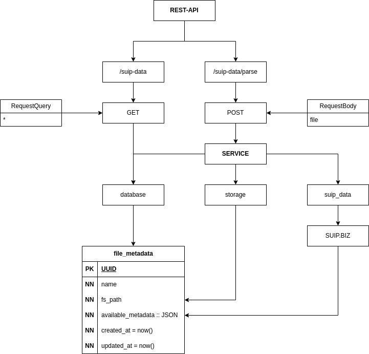

# File Metadata Parser

REST API для запуска парсинга и получения сохранённых данных - [ТЗ](./_readme/TestTask.pdf)

<h4>
<details>
<summary>Запуск проекта через Docker Compose</summary>
<pre>docker -v  # Docker version 27.5.1, build 9f9e405</pre>
</details>
</h4>

```bash
docker compose up --build
```


- <strong>Документация будет доступно по ссылке: http://0.0.0.0:8000/docs</strong>


---

| Использованные технологии | Ссылки                                                    |
| :-----------------------: | :-------------------------------------------------------: |
| FastAPI                   | https://fastapi.tiangolo.com                              |
| Uvicorn                   | https://www.uvicorn.org/                                  |
| SQLAlchemy                | https://www.sqlalchemy.org                                |
| PostgreSQL                | https://www.postgresql.org/                               |
| requests                  | https://requests.readthedocs.io/en/latest/                |
| bs4                       | https://www.crummy.com/software/BeautifulSoup/bs4/doc/    |
| Docker Compose            | https://docs.docker.com/compose                           |

<p align="center"></p>