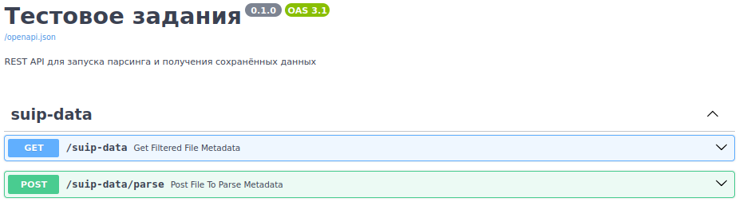

# File Metadata Parser

REST API для запуска парсинга и получения сохранённых данных - [ТЗ](./_readme/TestTask.pdf)

### Скачивание проекта
```bash
git clone \
  --single-branch \
  --depth=1 \
  https://github.com/ames0k0/TT--FastAPI--File-Metadata-Parser

cd TT--FastAPI--File-Metadata-Parser
```

### Запуск проекта через Docker Compose
<details>
  <summary>Зависимости</summary>
  <pre>
docker -v  # Docker version 27.5.1, build 9f9e405
python -V  # Python 3.12.8</pre>
</details>

```bash
docker compose up -d --build
```
| Сервис                        | Документация / SwaggerUI                  |
| ----------------------------- | ----------------------------------------- |
| http://127.0.0.1:8000/        | http://127.0.0.1:8000/docs                |


## REST API Эндпоинты
- <details>
  <summary><strong>GET /suip-data</strong> - Список сохранённых результатов с возможностью фильтрации</summary>

  | Параметры запроса   | Тип       | Описание              |
  | ------------------- | --------- | --------------------- |
  | Ключ=Значение       | Строка    | Фильтр по метаданным  |

  ```bash
  curl -X 'GET' \
    'http://127.0.0.1:8000/suip-data' \
    -H 'accept: application/json'
  ```

  ```bash
  # MIME тип=application/pdf
  curl -X 'GET' \
    'http://127.0.0.1:8000/suip-data?MIME%20%D1%82%D0%B8%D0%BF=application/pdf' \
    -H 'accept: application/json'
  ```

  ```json
  [
    {
      "id": "b4218b17-80f2-4172-b4f2-c731075b08f8",
      "fs_path": "static/file_metadata/b4218b17-80f2-4172-b4f2-c731075b08f8.json",
      "name": "тестовое задания.pdf",
      "available_metadata": {
        "Версия ExifTool": "13.30",
        "Название файла": "fileforsending",
        "Каталог": "/tmp",
        "Размер файла": "91 kB",
        "Дата редактирования файла": "2025:07:03 01:24:29+03:00",
        "Дата последнего доступа к файлу": "2025:07:03 01:24:29+03:00",
        "Дата изменения файлового индекса": "2025:07:03 01:24:29+03:00",
        "Разрешения файла": "-rw-r--r--",
        "Тип файла": "PDF",
        "Расширение файла": "pdf",
        "MIME тип": "application/pdf",
        "Версия PDF": "1.4",
        "Линеаризация": "Нет",
        "Количество страниц": "1",
        "Тегированный PDF": "Да",
        "Название": "тестовое задания",
        "Производитель": "Skia/PDF m139 Google Docs Renderer"
      }
    }
  ]
  ```

</details>

- <details>
  <summary><strong>POST /suip-data/parse</strong> - Ручной запуск парсинга</summary>

  | Тело запроса    | Тип   | Описание          |
  | --------------- | ----- | ----------------- |
  | file            | Файл  | Файл для парсинга |

  ```bash
  curl -X 'POST' \
    'http://127.0.0.1:8000/suip-dataparse' \
    -H 'accept: application/json' \
    -H 'Content-Type: multipart/form-data' \
    -F 'file=@тестовое задания.pdf;type=application/pdf'
  ```
</details>

---

<details>
<summary>Остановка и удаление проекта</summary>

- Docker-образов, Docker-контейнеров, Хранилище, Сети
```bash
docker compose down --volumes --rmi local
```
</details>

<details>
<summary>Файловая структура проекта</summary>

```bash
tree -a -I ".git|.venv|__pycache__|_readme|static|pgdata|__init__.py" --dirsfirst
```
<pre>
├── src
│   ├── core
│   │   └── config.py
│   ├── services
│   │   └── suip_data.py
│   └── main.py
├── docker-compose.yml
├── Dockerfile
├── pyproject.toml
├── README.md
├── requirements.txt
└── uv.lock
</pre>
</details>

<details>
  <summary>Использованные технологии</summary>

| Название          | Ссылки                                                    |
| :---------------: | :-------------------------------------------------------: |
| FastAPI           | https://fastapi.tiangolo.com                              |
| Uvicorn           | https://www.uvicorn.org/                                  |
| PostgreSQL        | https://www.postgresql.org/                               |
| requests          | https://requests.readthedocs.io/en/latest/                |
| bs4               | https://www.crummy.com/software/BeautifulSoup/bs4/doc/    |
| Docker Compose    | https://docs.docker.com/compose                           |

</details>

<p align="center">
  
  
</p>